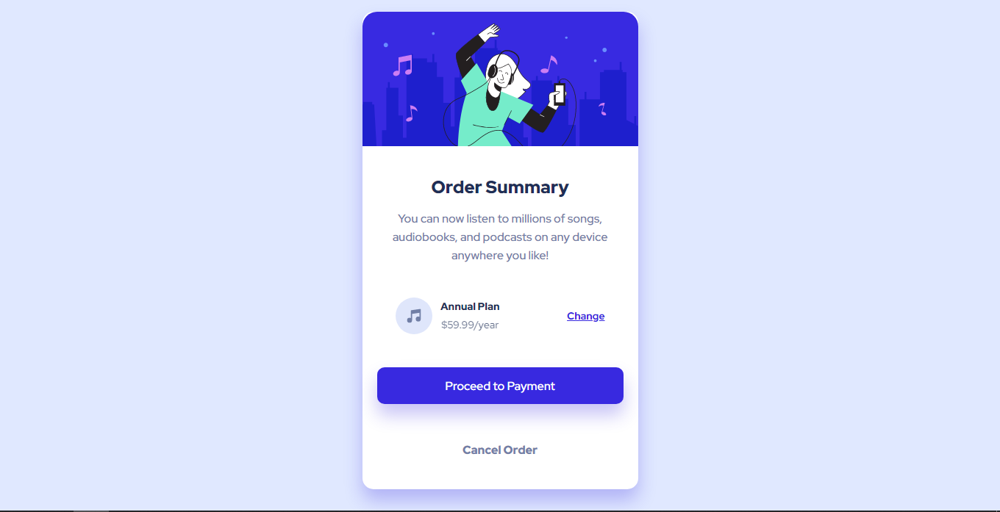

# Frontend Mentor - Order summary card solution

This is a solution to the [Order summary card challenge on Frontend Mentor](https://www.frontendmentor.io/challenges/order-summary-component-QlPmajDUj).

## Table of contents

- [Overview](#overview)
  - [Screenshot](#screenshot)
  - [Links](#links)
- [My process](#my-process)
  - [Built with](#built-with)
- [Author](#author)

## Overview

### Screenshot

### Links

- Solution URL: [Add solution URL here](https://github.com/jonniermartinez/OrderSummary)
- Live Site URL: [Add live site URL here](https://jonniermartinez.github.io/OrderSummary/)

## My process

### Built with

- Semantic HTML5 markup
- CSS custom properties

## Author

- Twitter - [@JonnierMartinez](https://twitter.com/JonnierMartinez)